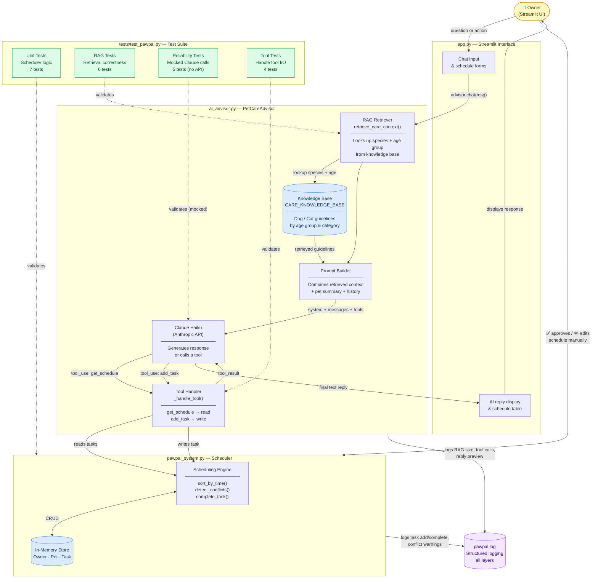

# PawPal+ System Architecture

Paste the code block below into https://mermaid.live, then export as PNG and save it as `assets/architecture.png`.

```mermaid
flowchart TD
    User(["👤 Owner\n(Streamlit UI)"])

    subgraph UI ["app.py — Streamlit Interface"]
        ChatInput["Chat input\n& schedule forms"]
        ChatOutput["AI reply display\n& schedule table"]
    end

    subgraph Advisor ["ai_advisor.py — PetCareAdvisor"]
        direction TB
        RAG["RAG Retriever\nretrieve_care_context()\n─────────────────\nLooks up species + age group\nfrom knowledge base"]
        KB[("Knowledge Base\nCARE_KNOWLEDGE_BASE\n─────────────────\nDog / Cat guidelines\nby age group & category")]
        Prompt["Prompt Builder\n─────────────────\nCombines retrieved context\n+ pet summary + history"]
        LLM["Claude Haiku\n(Anthropic API)\n─────────────────\nGenerates response\nor calls a tool"]
        ToolHandler["Tool Handler\n_handle_tool()\n─────────────────\nget_schedule → read\nadd_task → write"]
    end

    subgraph Engine ["pawpal_system.py — Scheduler"]
        SchedLogic["Scheduling Engine\n─────────────────\nsort_by_time()\ndetect_conflicts()\ncomplete_task()"]
        Store[("In-Memory Store\nOwner · Pet · Task")]
    end

    Log[("pawpal.log\nStructured logging\nall layers")]

    subgraph Tests ["tests/test_pawpal.py — Test Suite"]
        T1["Unit Tests\nScheduler logic\n7 tests"]
        T2["RAG Tests\nRetrieval correctness\n6 tests"]
        T3["Reliability Tests\nMocked Claude calls\n5 tests (no API)"]
        T4["Tool Tests\nHandle tool I/O\n4 tests"]
    end

    %% ── main data flow ──────────────────────────────────────────────
    User -->|"question or action"| ChatInput
    ChatInput -->|"advisor.chat(msg)"| RAG
    RAG -->|"lookup species + age"| KB
    KB -->|"retrieved guidelines"| Prompt
    RAG --> Prompt
    Prompt -->|"system + messages + tools"| LLM

    LLM -->|"tool_use: get_schedule"| ToolHandler
    LLM -->|"tool_use: add_task"| ToolHandler
    ToolHandler -->|"reads tasks"| SchedLogic
    ToolHandler -->|"writes task"| SchedLogic
    SchedLogic <-->|"CRUD"| Store
    ToolHandler -->|"tool_result"| LLM

    LLM -->|"final text reply"| ChatOutput
    ChatOutput -->|"displays response"| User

    %% ── human checkpoint ────────────────────────────────────────────
    User -->|"✅ approves / ✏️ edits\nschedule manually"| Engine

    %% ── logging ─────────────────────────────────────────────────────
    Advisor -->|"logs RAG size, tool calls,\nreply preview"| Log
    Engine -->|"logs task add/complete,\nconflict warnings"| Log

    %% ── testing ─────────────────────────────────────────────────────
    T1 -. "validates" .-> Engine
    T2 -. "validates" .-> RAG
    T3 -. "validates (mocked)" .-> LLM
    T4 -. "validates" .-> ToolHandler

    %% ── styles ──────────────────────────────────────────────────────
    classDef store fill:#dbeafe,stroke:#3b82f6,color:#1e3a5f
    classDef human fill:#fef9c3,stroke:#ca8a04,color:#3f2d00
    classDef test  fill:#dcfce7,stroke:#16a34a,color:#14532d
    classDef log   fill:#f3e8ff,stroke:#9333ea,color:#3b0764

    class KB,Store store
    class User human
    class T1,T2,T3,T4 test
    class Log log
```
